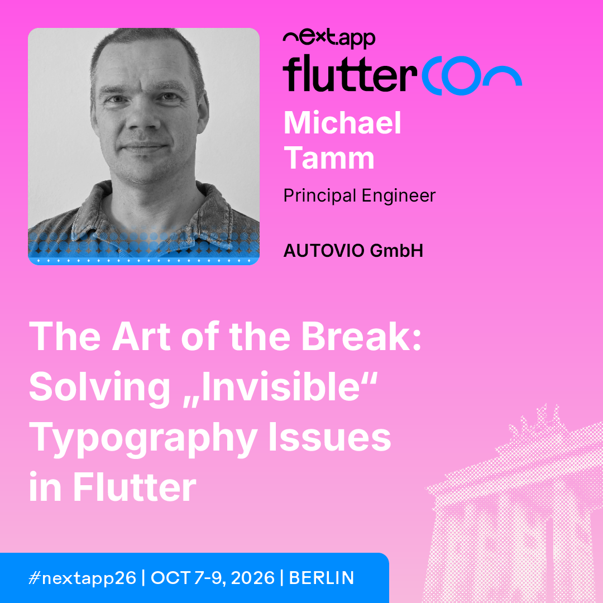

# The Art of the Break

This a companion Flutter widgetbook app to my talk [The Art of the Break: Solving "Invisible" Typography Issues in Flutter](https://www.nextappcon.com/fluttercon-new-speakers/michael-tamm) at the flutterCon 2026. 

You can see it in action here: [https://the-art-of-the-break.web.app](https://the-art-of-the-break.web.app)

